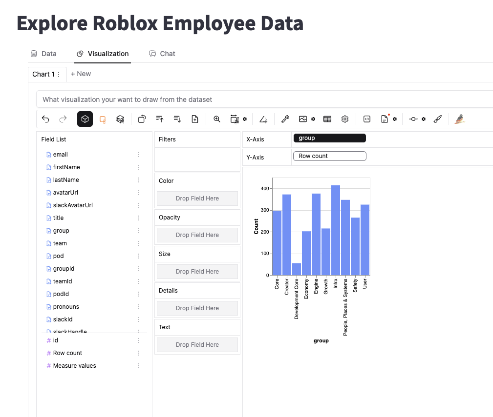
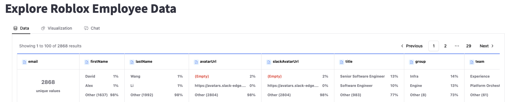
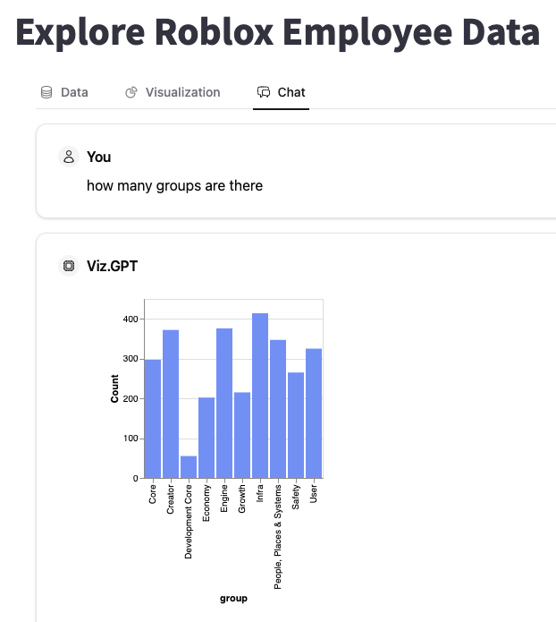

# kc-pygwalker-demo

Demo repo for the capabilities of pygwalker

1.  Install the following packages

```
pip install pygwalker streamlit openai
```

- openai above is optional. You can use a local LLM or ML gateway at Roblox

2. Copy .streamlit/secrets.toml.local to.streamlit/secrets.toml and enter your keys there.

3. Run the following command

```
streamlit run main.py
```

4. Streamlit will launch an app.

5. Clicking on pygwalker demo on the sidebar should open up with a pygwalker interface for exploring employee data



6. You can use the data tab to get an overview of all fields in the results



7. You can also chat with your data in the chat tab after you setup an account in Kanaries



### To chat with dataframes

We are using [PandasAI](https://github.com/Sinaptik-AI/pandas-ai) to chat with dataframes. For this you need to install the library

```
pip install pandasai
```

### To chat with datalake

```
pip install llama_index llama_hub llama-index-agent-openai
```

#### Planned enhancements

1. Add an agentic workflow to make the chart smarter and call the pandasai as an option if it feels it is needed vs. always calling it
2. Add a page that will take any csv and let you chat with it
3. Add a page that lets you analyze all files in RDL
