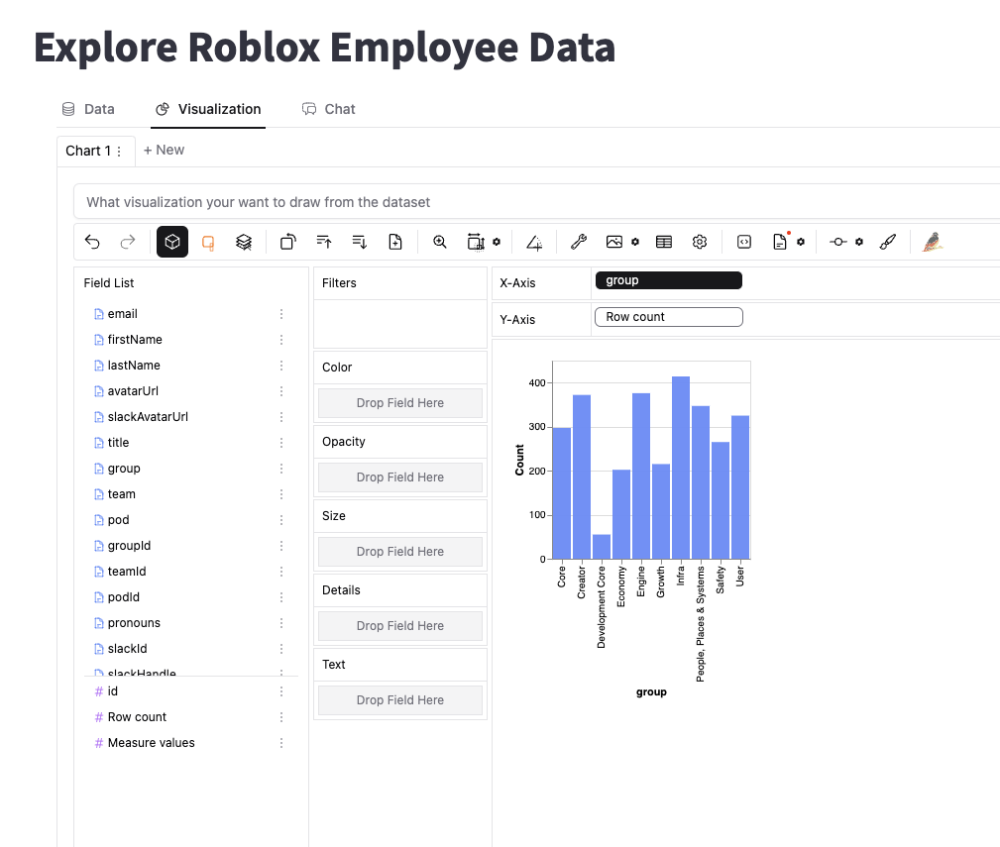

# kc-pygwalker-demo

Demo repo for the capabilities of pygwalker

1.  Install the following packages

```
pip install pygwalker streamlit
```

2. Copy .env.local to .env and set your ROS API key there

3. Run the following command

```
streamlit run app.py
```

4. A new window should open up with a pygwalker interface for exploring employee data

